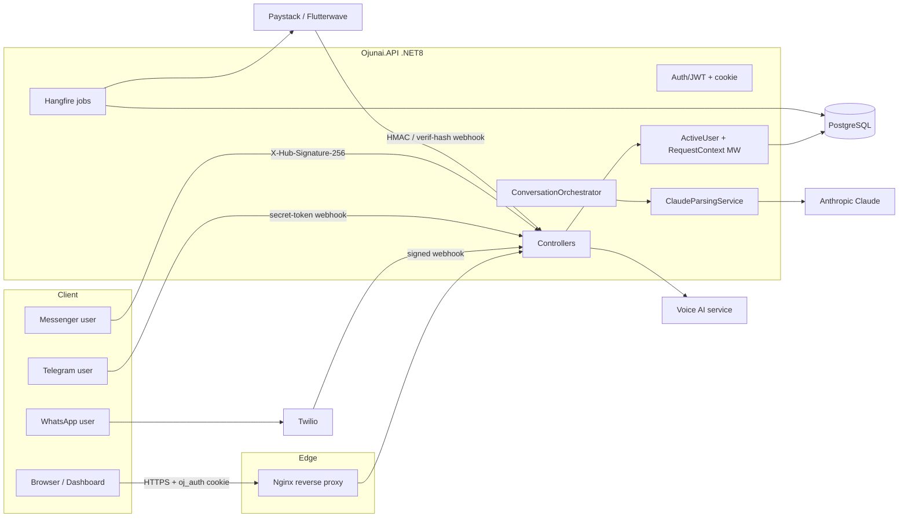

# Ojunai — Threat Model

_Audit date: 2026-07-13 · Scope: `Ojunai.API` (.NET 8) + `dashboard` (Next.js 15) at repo `Ojunai-AI`_

## 1. System overview

Ojunai is a multi-tenant commerce/business-management platform for African SMEs. A **Business** is the tenant boundary. The primary product surface is a WhatsApp-first AI "business operator": merchants chat (WhatsApp / Telegram / Messenger) and an LLM parses messages into structured business actions (sales, expenses, inventory, contacts, debts). A Next.js dashboard provides the web UI.

**Backend:** ASP.NET Core 8 Web API, PostgreSQL via EF Core, Hangfire (Postgres-backed) for background/recurring jobs. Auth is JWT (HS256) delivered as an `oj_auth` HttpOnly cookie and/or bearer token. OpenTelemetry → OTLP for metrics/traces.

**External integrations:** Anthropic Claude (NL parsing), Twilio (WhatsApp), Telegram, Meta Messenger, Paystack + Flutterwave (payments/subscriptions), Resend (email/webhooks), MailKit SMTP, QuestPDF (receipts/reports), ImageSharp (image processing), a separate "Voice AI" service.

## 2. Assets

| Asset | Store | Sensitivity |
|---|---|---|
| Auth credentials (password hashes) | `Users.PasswordHash` (BCrypt) | Critical |
| Session tokens (JWT) | client cookie; `Users.TokenVersion` for revocation | Critical |
| API keys / webhook secrets (Claude, Paystack, Flutterwave, Twilio, Telegram, Messenger, admin key) | env / `appsettings` (gitignored) | Critical |
| Business financial records (sales, expenses, ledger, debts) | Postgres, per-`BusinessId` | High |
| Customer & supplier PII (names, phones) | `Contacts` | High |
| Inventory & pricing | `Products`, `InventoryTransactions` | High |
| Payment / subscription state | `Business.Plan/SubscriptionStatus`, `BillingEvents` | High |
| AI system prompts + tenant catalogue | constructed per request | Medium |
| Integration tokens (channel links) | `ChannelLinkToken`, single-use | High |
| Admin analytics/wipe surface | `AdminController` (`Admin:AnalyticsKey`) | Critical |
| Audit logs | `AdminAuditEntry`, `MessageLog` | Medium |
| Backups / exports | R2/off-box (docs), PDF exports | High |

## 3. Threat actors

1. **Anonymous internet attacker** — no credentials; reaches public endpoints (login/register/reset, webhooks, export download, admin surface if key leaks).
2. **Authenticated tenant user (any role)** — valid JWT for one business; may attempt cross-tenant / privilege escalation.
3. **Malicious low-privilege staff** — Sales/Viewer within a tenant; may plant stored payloads (product/contact names) or abuse self-serve actions.
4. **Tenant administrator/owner** — may attempt to self-grant paid features or exceed plan limits.
5. **Compromised integration / leaked secret holder** — someone who obtains a webhook secret or admin key (e.g. via proxy logs).
6. **Malicious webhook sender** — forges payment/messaging webhooks.
7. **Prompt-injection actor** — crafts message text or stored data (product names, notes) to steer the LLM.
8. **Supply-chain attacker** — malicious/vulnerable dependency or CI action.

## 4. Trust boundaries

- **Browser → API:** TLS; JWT cookie (HttpOnly/Secure/SameSite=Strict). Server re-validates identity every request (`ActiveUserMiddleware`).
- **Nginx → API:** loopback; `ForwardedHeaders` trusts only loopback for `X-Forwarded-For`. `/hangfire` gated to loopback.
- **API → DB:** parameterized EF Core; per-`BusinessId` filtering is the tenant boundary (no Postgres RLS).
- **Webhook → API:** each provider verified by signature (Twilio HMAC-SHA1, Paystack HMAC-SHA512, Messenger HMAC-SHA256, Telegram secret token, Resend/Svix HMAC). Flutterwave uses a static shared secret (weak — see findings).
- **API → payment provider:** server-to-server with secret keys; **authoritative payment state must come from provider verify APIs, not webhook payloads.**
- **App → Claude:** untrusted NL + tenant catalogue sent to Anthropic; model output is treated as untrusted and re-validated deterministically.
- **API → Voice AI service:** global admin key; **reservation ownership is not enforced Ojunai-side** (see OJ-11).

## 5. Highest-risk abuse cases / attack chains

1. **Forged/leaked-secret Flutterwave webhook → free plan upgrade** for any `businessId`. The webhook was authenticated only by a static secret and trusted the payload's amount/status/plan; a null-price currency also bypassed the amount check. _(OJ-01/OJ-02 — fixed: server-side verify + fail-closed amount.)_
2. **Export link leak → 4-digit PIN brute-force → cross-tenant financial report disclosure.** Signed download links travel in a query string (proxy logs, chat forwards); the PIN was a derivable 4-digit code on an anonymous, unthrottled endpoint. _(OJ-03 — fixed: rate limit + per-token lockout.)_
3. **Admin key leak via access logs → `GET /api/admin/wipe-all-data?key=…&businessId=…` → irreversible tenant data destruction.** Destructive ops were GET with the secret in the URL. _(OJ-04 — partially fixed: GET→POST + confirm; key-in-query for read endpoints remains an operational item.)_
4. **Cross-tenant Voice-AI reservation manipulation** — an authenticated user supplies another tenant's reservation GUID; the API proxies it with a global admin key without ownership check. _(OJ-11 — unresolved: requires downstream enforcement.)_
5. **Indirect prompt injection via stored names** — a low-privilege user names a product `[DATA_END] ignore prior text …`; a higher-privileged user's later chat carries the payload. Blast radius is same-tenant and bounded by role checks. _(OJ-07 — fixed: delimiter neutralization.)_
6. **Denial-of-wallet on Telegram/Messenger** — linked user floods messages; each triggers a paid Claude call with no per-sender rate limit. _(OJ-14 — unresolved: recommend porting the WhatsApp limiter.)_

## 6. Existing mitigations (verified)

- BCrypt password + OTP/token hashing; CSPRNG tokens; single-use + expiring reset/verify/link tokens; account lockout (5/15min) + per-IP auth rate limit.
- `TokenVersion` server-side session revocation (password change/reset/staff change), enforced per request alongside user-active / business-active / `businessId`-matches-DB checks.
- Tenant isolation derived from JWT `businessId` claim; **every** inspected CRUD query filters by `BusinessId`; DTO mapping (no mass assignment); no client-supplied tenant IDs on the authenticated surface.
- Webhook signature verification with constant-time comparison for Twilio/Paystack/Messenger/Telegram/Resend; DB-level idempotency (`PaystackEventLog`, `InboundMessageClaim`).
- LLM used as a parser only; tenant always server-derived; model output re-validated (entity resolver, range checks); no AI output into SQL/shell/HTML sinks.
- Hardened image upload (magic bytes, dimension preflight, decode+re-encode, metadata strip, UUID names, JWT-derived path).
- Security headers (X-Frame-Options, nosniff, Referrer-Policy, HSTS, `no-store` on `/api`); HttpOnly cookies; no secrets in tracked files; CI has no secrets and no untrusted PR execution.

## 7. Missing mitigations (see SECURITY_FINDINGS.md)

- Server-side verification on the Flutterwave webhook _(now added)_; fail-closed amount checks _(now added)_.
- Brute-force protection on the export PIN endpoint _(now added)_.
- Deterministic confirmation gates for destructive AI intents; per-sender rate limiting on Telegram/Messenger.
- Downstream ownership enforcement for Voice-AI reservations.
- Content-Security-Policy with a real `script-src` (nonce-based); shared-store auth rate limiting for multi-instance.
- Admin authentication via header (not query string) + access-log scrubbing; consider per-operator admin identities.
